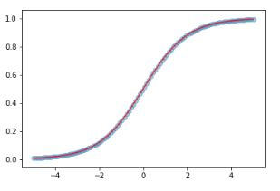
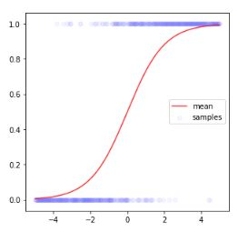
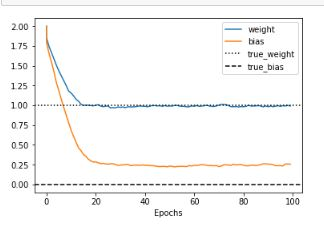
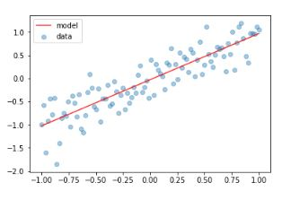
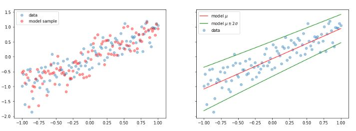
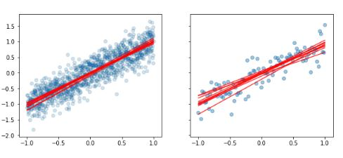
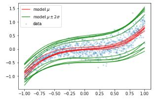
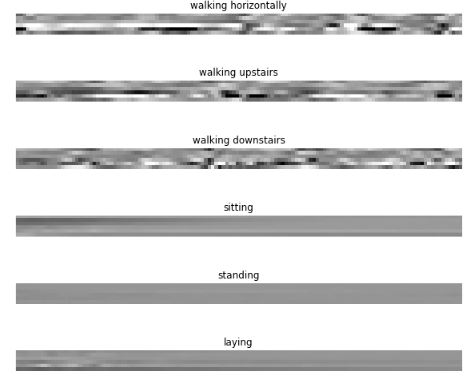
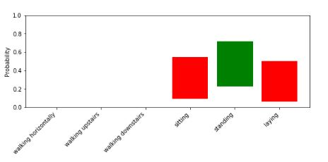

# TensorFlow Probabilistic Layers - Bayesian Neural Networks
- In this project, I explored Bayesian Neural Networks (BNNs) using TensorFlow Probability layers.
- You can get the code in [tensorflow_probabilistic_layers__bnn.ipynb](./tensorflow_probabilistic_layers__bnn.ipynb)

## Building Bayesian Neural Networks
- We implemented a simple Bayesian Neural Network using TensorFlow Probability's `DenseVariational` layers to model uncertainty in the network's weights.

### Deterministic Neural Network:
- Here’s the deterministic neural network with a sigmoid activation.

- A probabilistic network with sigmoid activation.

### Training:
- The training process of the Bayesian Neural Network and its results(fits mean and stddev parameters towards the true values).

### Probabilistic Neural Network:
- After that, we introduced a Bayesian neural network, which outputs a distribution over the predictions rather than a single deterministic value.

- This figure shows a traditional deterministic neural network with linear activation.

- A probabilistic network with linear activation.

### Variational Layers and Uncertainty:
- Visualized how variational layers in BNNs model uncertainty in predictions.

- Example of a Bayesian layer with linear activation.

- Example of a Bayesian layer with non-linear activation.

### Movement Data and Probability Estimation:
- Trained the BNN on movement data and visualized how the network predicts different probabilities for different inputs.

- The movement data used for training the model:

- The model's probabilistic output over a single movement data:

## Setup
- Create virtual environment: `python -m venv venv`
- Activate virtual environment: `call venv/Scripts/activate.bat` in cmd
- Install dependencies: `pip install -r requirements.txt`

# Libraries
- TensorFlow
- TensorFlow Probability
- Matplotlib

## Contact
- LinkedIn: [Natan Asrat](https://linkedin.com/in/natan-asrat)
- Gmail: nathanyilmaasrat@gmail.com
- Telegram: [Natan Asrat](https://t.me/fail_your_way_to_success)
- Youtube: [Natville](https://www.youtube.com/@natvilletutor)
